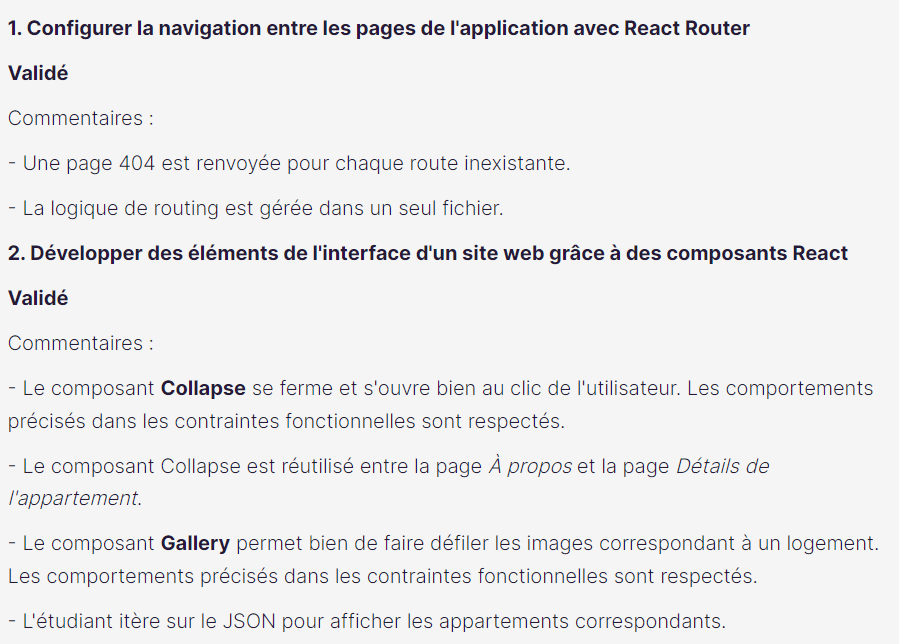
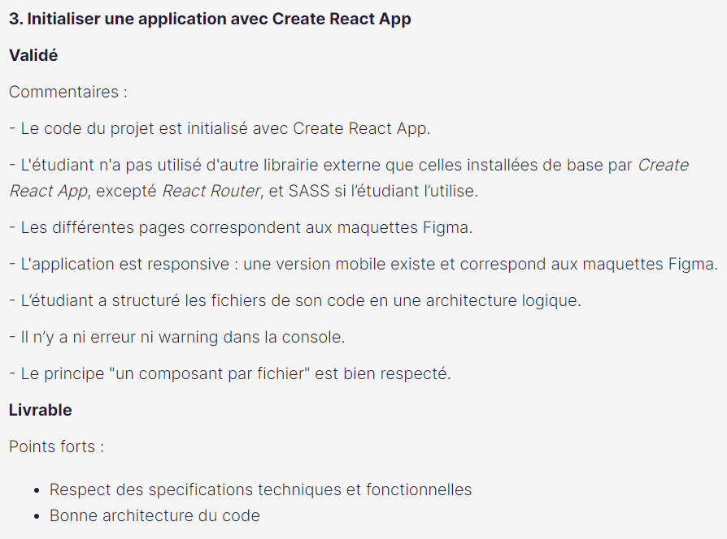
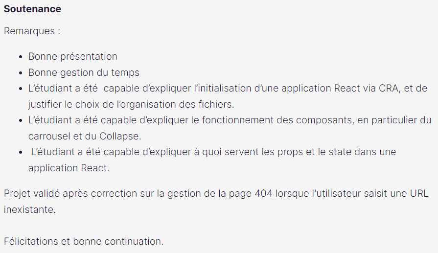

# Kasa - Projet d'études

- Lien du site : https://hugo-de-yrigoyen.github.io/kasa/
- Dans le cadre des mes études de développeur web
- Site de réservation de logements sur **React en JSX et CSS uniquement** (pas de Typescript)

## Contexte

- Instructions :
  https://course.oc-static.com/projects/Front-End+V2/P9+React+1/Coding+guidelines+Kasa+FR.pdf
- Maquette Figma :
  https://www.figma.com/file/bAnXDNqRKCRRP8mY2gcb5p/UI-Design-Kasa-FR?node-id=3%3A0

## Démarrage

A la racine du projet, lancez la commande "npm run start"

## Évaluation

- Projet validé
- Commentaires :
  
  
  
